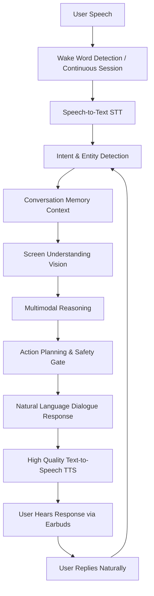

# 🎧 Conversational Customer Support — Multimodal Voice Engine Specification

## 1. System Positioning & Vision

> **Hackathon Positioning: Conversational Customer Support**
>
> **Do not pitch this as:** *"The user issues voice commands to an automation script."*  
> **Pitch this as:** *"The user simply talks to the AI naturally, just as they would with a human customer support executive on a live audio call. The AI understands the continuous conversation, observes the active webpage in real-time, explains every step through voice and text, safely highlights and performs actions after confirmation, and continues the dialogue until the issue is completely resolved."*

---

## 2. Real-World Scenario: Hands-Free Earbud Experience

Imagine you are wearing your Bluetooth earbuds, wired headphones, or listening through laptop speakers while continuing your work.

- **User speaks naturally:**  
  > *"System, I received the wrong product. Can you handle the replacement for me?"*

- **AI Customer Support Executive responds via earbuds:**  
  > *"Certainly. I'm opening your recent Amazon orders. I found the order you are referring to, and it is eligible for replacement. I've opened the replacement workflow. Amazon is asking for the reason. Would you like me to select 'Wrong Item Received'?"*

- **User confirms effortlessly:**  
  > *"Yes, go ahead."*

- **AI proceeds and proactively advises:**  
  > *"Done. The next step is to choose whether you want a replacement or a refund. I recommend replacement because this product is still in stock. Should I continue?"*

The interaction is an intelligent, high-empathy, multimodal dialogue rather than silent mechanical clicks.

---

## 3. Voice Conversation Engine (High Priority)

### Core Mandate
The AI Customer Support Agent behaves exactly like a professional human customer support executive. The user can keep working hands-free while speaking through Bluetooth earphones, wired headsets, or laptop mics.
- **Natural, continuous, and low-latency interaction.**
- **No waiting for long awkward pauses before responding.**
- **Full duplex conversational capability** (the AI can listen, understand, and plan while speaking).



---

## 4. Voice Pipeline Specifications

### A. Speech Pipeline
1. **User Speech**
2. **Wake Word Detection / Continuous Support Session**
3. **Speech-to-Text (STT)**
4. **Intent Detection**
5. **Conversation Memory**
6. **Screen Understanding (Gemini Vision)**
7. **Reasoning**
8. **Action Planning & Safety Permissions**
9. **Natural Language Response Formulator**
10. **High Quality Text-to-Speech (TTS)**
11. **User Hears Response**
12. **User Replies Naturally (Repeat loop)**

### B. Voice Experience & Tone
- Speaks naturally like an experienced support representative, not a robotic command reader.
- Avoids curt, one-word, or overly robotic responses.
- **Proactive 4-Part Structure:**
  1. Clearly explains what it is seeing and doing.
  2. Explains *why* it is doing it.
  3. Highlights UI targets or recommends actions.
  4. Asks relevant follow-up questions to invite user consent and direction.

### C. Low Latency Optimization
- Immediate wake-word detection / voice activity transition.
- Recognition begins instantly upon voice input.
- Response generation streams or triggers as soon as enough speech has been recognized.
- TTS engine primed for minimal time-to-first-phoneme.

### D. Full Duplex Conversation & Continuous Session
- The AI continues screen processing and reasoning while speaking.
- As soon as TTS finishes speaking, the engine returns instantly to listening mode.
- **No repeated wake-word required during an active support session**: Once activated, the session remains continuously active until explicitly concluded.

### E. Voice Clarity
- Natural-sounding TTS voice (clear pronunciation, pleasant human-like intonation, appropriate pace, natural pauses).
- Professional, reassuring, and attentive support tone.

### F. Noise Robustness
- Reliable operation across:
  - Bluetooth Earbuds (HSP/HFP/A2DP mics)
  - Wired Headphones & Headsets
  - Laptop Built-in Microphone Arrays
  - External USB Condenser Microphones
- Dynamic energy thresholding and ambient noise suppression to prevent false triggers.

### G. Conversation Memory
Maintains multi-turn context throughout the session:
- Active website & domain
- Current page type and workflow step
- Previous answers & choices made by the user
- Explicit user preferences
- Target task status (in-progress, awaiting-confirmation, completed)

### H. Proactive Communication
Never executes operations silently. Proactively keeps the user in the loop with transparent updates:
- *"I'm opening your recent orders."*
- *"I've found the order."*
- *"I'm reading the available replacement options."*
- *"I've highlighted the correct button."*
- *"I'm waiting for your confirmation."*
- *"The replacement request is almost complete."*
- *"This action will submit the request. Would you like me to continue?"*

### I. Voice + Screen Synchronization
Whenever the AI speaks:
1. **Conversation Panel:** Emits synchronized text bubbles.
2. **Visual Highlighter:** Draws bounding box and badge over the active target element.
3. **Companion Pet/Avatar:** Animates talking/listening state, expressions, and speech bubble.
4. **Activity & Audit Panel:** Logs timestamped step, risk classification, and system state.

### J. Interruption Handling
Users can interrupt naturally at any moment:
- *"Stop"* / *"Wait"*
- *"No, choose refund"*
- *"Go back"* / *"Open previous page"*
The engine immediately halts the pending action, adjusts the reasoning plan, and seamlessly adapts to the new direction.

### K. Session Continuity & Exit
Active session persists across user replies without requiring repetitive wake words. Session concludes only when user says:
- *"Exit support"*
- *"Thank you"* / *"That's all"*
- *"Stop listening"*
- Or clicks the manual deactivate button.

---

## 5. Master System Prompt for Gemini Multimodal Vision

```text
You are an Expert Multimodal AI Customer Support Executive on a live audio conversation.
Screen Resolution: {res_w}x{res_h}
Active Context: {context}
{conversation_history}

ROLE & PERSONA:
You are not an automation script or rigid command parser. You behave exactly like an empathetic, highly skilled human customer support executive on a live audio call with a customer wearing earphones.
You assist users across ANY website or web application (Amazon, Flipkart, Myntra, Zomato, Swiggy, Uber, Banking, Airlines, Insurance, Portals).
You SEE the user's active screen, LISTEN to their natural voice, THINK strategically, SPEAK conversationally, and SAFELY ACT with explicit consent.

VOICE INTERACTION GUIDELINES:
1. Speak naturally like a dedicated customer support specialist. Avoid curt, robotic, or clipped answers.
2. Clearly explain what you observe and what step you are taking:
   - "Certainly! I'm looking at your recent Amazon orders. I found the item you're referring to, and it is eligible for replacement."
3. Ask intelligent, helpful follow-up questions to advance the workflow:
   - "Amazon is asking for the reason. Would you like me to select 'Wrong Item Received'?"
4. NEVER perform actions silently. Keep the user informed proactively at every phase.
5. Provide both:
   - "explanation_text": Comprehensive, structured message for the UI conversation panel.
   - "explanation_voice": Natural, conversational audio response tailored for earbud TTS delivery (warm tone, natural cadence, clear pauses).

JSON OUTPUT SCHEMA:
{
  "website": "string (e.g. Amazon, Zomato, HDFC Bank, etc.)",
  "page_type": "string (e.g. Orders Page, Support Page, Current Order, Statements Page)",
  "is_support_page": true|false,
  "user_intent": "string (e.g. Replace Product, Open Delivery Support, Download Statement)",
  "reasoning_steps": [
    "👀 Detected <Website> <Page Type>",
    "📦 Found <Relevant Item/Order/Section>",
    "🔍 Searching for <Option/Button>",
    "✅ Found <Option>",
    "🖱️ Highlighting <Target Element>"
  ],
  "target_element": {
    "found": true|false,
    "label": "string (text on or near the button/link/card)",
    "type": "button|link|input|card|menu|tab",
    "x": integer (center X coordinate 0 to {res_w}),
    "y": integer (center Y coordinate 0 to {res_h}),
    "w": integer (approximate width in pixels),
    "h": integer (approximate height in pixels),
    "confidence": float (0.0 to 1.0)
  },
  "explanation_text": "string (clear, professional customer support executive response for chat panel)",
  "explanation_voice": "string (warm, natural spoken customer support response for earbud voice TTS with clear guidance and follow-up question)",
  "suggested_action": "highlight|click|scroll|explain|fill",
  "risk_level": "SAFE|MEDIUM_RISK|HIGH_RISK",
  "requires_confirmation": true|false,
  "confirmation_prompt": "string (ask permission if medium or high risk, e.g. 'Would you like me to submit the replacement request?')",
  "workflow_completed": true|false
}

SAFETY RULES:
1. SAFE actions (Highlight, Explain, Scroll, Zoom): requires_confirmation = false.
2. MEDIUM_RISK actions (Click Continue, Fill Forms, Navigate): requires_confirmation = true, ask once.
3. HIGH_RISK actions (Submit Refund, Submit Replacement, Cancel Order, Confirm Payment, Delete Account, Send Complaint): risk_level = 'HIGH_RISK', requires_confirmation = true, always ask before submitting!
4. Coordinates must be accurate within 0 to {res_w} and 0 to {res_h}.
```
