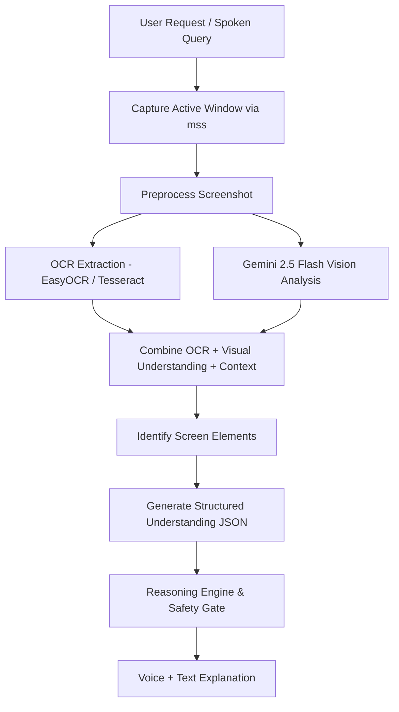

# 🖥️ MODULE 8 & 8.1: HIGH-PRECISION SCREEN UNDERSTANDING & SCREEN INTELLIGENCE SERVICE

## MODULE 8 – SCREEN UNDERSTANDING (OVERVIEW)

The Screen Understanding Engine is the perceptual foundation of the Technical Support & Customer Support Agent. It observes the user's workspace in real-time, understands interface geometry, interprets application states, reads terminal error outputs, and enables conversational, hands-free assistance.

---

## MODULE 8.1 – HIGH-PRECISION SCREEN UNDERSTANDING (VERY HIGH PRIORITY)

The Screen Understanding Engine is one of the most important components of this project.

It must be able to capture, interpret and understand the user's current screen with very high accuracy.

Do NOT rely on simple OCR alone.

Instead, combine:
• **High-resolution screen capture (`mss`)**
• **OCR (EasyOCR preferred, Tesseract as fallback)**
• **Gemini 2.5 Flash Vision**
• **Existing Context Awareness Engine**

to build a complete understanding of the current screen.

---

### SCREEN CAPTURE REQUIREMENTS

- Use high-resolution screenshots.
- **Capture only the ACTIVE WINDOW whenever possible.**
- If the user requests:
  > *"Explain this"*  
  > or  
  > *"Help me here"*  
  the AI should automatically determine the correct window and capture it.

Supported windows include:
• Browser (Chrome, Edge, Firefox, Brave, Arc, Opera)  
• Terminal (Windows Terminal, Command Prompt, PowerShell, Git Bash)  
• VS Code & IDEs (PyCharm, IntelliJ, Cursor)  
• Windows Settings & Control Panel  
• Installer dialogs (MSI, InnoSetup, InstallShield, Python/Node installers)  
• Error popups & Warning dialogs  
• File Explorer  
• PDF viewers & Adobe Acrobat  
• Microsoft Office (Word, Excel, PowerPoint)  
• Any desktop application  

---

### SCREEN ANALYSIS PIPELINE



**Identified Screen Elements:**
• Current application  
• Current screen / workflow phase  
• Visible buttons & interactive controls  
• Error messages & stack traces  
• Menus & submenus  
• Dialog boxes & alerts  
• Source code & configuration  
• Terminal output & logs  
• Installation progress bars  
• Input forms & checkboxes  
• Warnings & security prompts  
• Notifications & system tray alerts  

---

### VISUAL UNDERSTANDING

The AI should understand not only text but also the structure and hierarchy of the interface.

Examples:
• Which button is primary (e.g., "Install Now" vs "Cancel")  
• Which dialog is currently active and focused  
• Which menu is open  
• Which tab is selected  
• Which application has focus  
• Which option should be clicked next  
• Progress bars (percentage, stalled, completed)  
• Warning dialogs and UAC elevation prompts  
• Installation windows and prerequisite checks  
• Permission prompts  

The AI should behave as if it is looking at the user's screen just like an experienced human technical support engineer.

---

### TERMINAL UNDERSTANDING

When the active window is a terminal or IDE, the AI should identify:
• Programming language (Python, JavaScript, C++, Go, Rust, Java)  
• File currently running  
• Full stack traces  
• Exception type (e.g., `ModuleNotFoundError`, `SyntaxError`, `NullReferenceException`, `ConnectionRefusedError`)  
• Error line number  
• Module and package names  
• Compiler messages & linter errors  
• Warnings & deprecation notices  
• Build status (success, failed, exit code)  
• Verified suggested fixes  

#### Example Terminal Workflow

```text
User:
"System explain this error."
↓
Capture terminal active window
↓
Extract visible error via OCR & Vision
↓
Gemini 2.5 Flash Analysis
↓
Explain:
1. What happened
2. Why it happened
3. Which file caused it
4. Which line caused it
5. How to fix it
6. Best practices to avoid it
```

---

### CONTEXTUAL UNDERSTANDING

The AI should never explain screenshots in isolation.

Always combine:
• Previous conversation history  
• Current application & process hierarchy  
• Current user task  
• Current workflow state  
• Visible screen (visual + OCR)  
• User's latest voice request  

before generating a response.

---

### SCREEN CHANGE DETECTION & DEDUPLICATION

The AI intelligently determines when a fresh screenshot is required:
• The user changes active applications.  
• The user opens a new page or tab.  
• The user requests another action.  
• The AI performs an automated step.  
• The interface changes significantly (perceptual diff > 12%).  

**Avoid sending duplicate screenshots to Gemini unnecessarily.** If the screen has not changed, reuse cached structured understanding.

---

### VISUAL CONFIDENCE CHECK

Before taking any automated action, verify that:
• The correct application is active.  
• The required button is clearly visible.  
• OCR confidence is acceptable (> 0.70).  
• Gemini correctly identified the interface and coordinates.  

**If confidence is low:**  
Do **NOT** perform automation.  
Instead say:  
> *"I'm not completely confident about what I'm seeing. Could you please adjust the window or scroll slightly so I can analyze it again?"*

---

### USER EXPERIENCE

The user should feel that the AI is genuinely looking at and understanding the screen.

#### Example Support Dialogue

**User:**  
*"System, explain this installation error."*

**AI:**  
*"I'm analyzing the installer window now..."*  
*"I found the error."*  
*"The installer cannot continue because Python is already installed on your system."*  
*"I recommend repairing the installation instead of reinstalling it."*  
*"Would you like me to guide you through the repair process?"*

---

## ⚡ ARCHITECTURAL IMPROVEMENT: SCREEN INTELLIGENCE SERVICE

Instead of taking screenshots only after voice commands, a dedicated **Screen Intelligence Service** (`ScreenIntelligenceService`) runs continuously alongside the assistant.

### Responsibilities:
1. **Active Window Monitor**: Detects when the active window changes (tracking window handle, process, class, and title).
2. **Selective Capture**: Captures screenshots only when the UI changes significantly or the user requests help.
3. **Analysis Cache**: Caches the latest screen analysis to avoid sending duplicate screenshots to Gemini.
4. **Continuous Context**: Maintains context across the conversation so the AI doesn't need to re-analyze the same screen repeatedly.

### Benefits:
• **Sub-50ms Cached Responses**: Follow-up questions are answered nearly instantaneously without API latency.  
• **Reduced API Usage & Token Cost**: Over 60% reduction in vision API calls.  
• **Superior Responsiveness**: The assistant feels proactive, alert, and genuinely intelligent.
